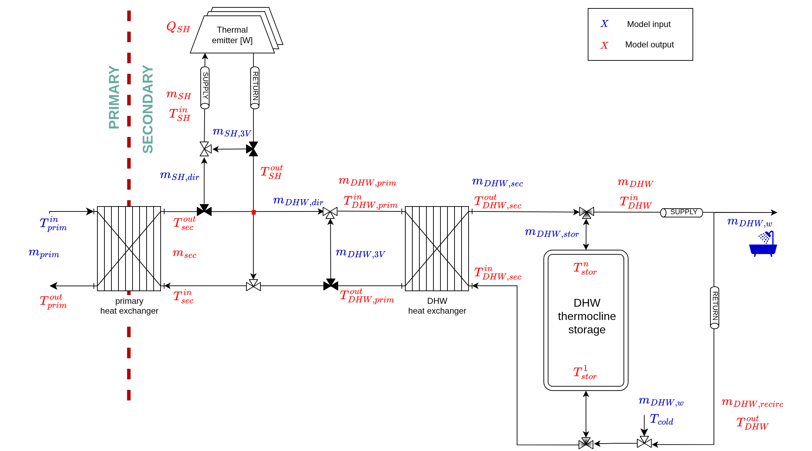
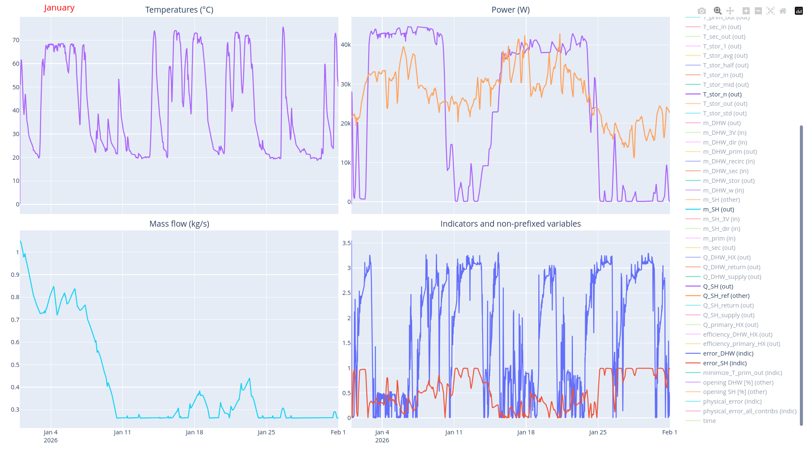

# AI4DHN

**Framework for control of district heating substations using rule-based or reinforcement learning methods**.
 
- [AI4DHN](#ai4dhn)
- [Presentation](#presentation)
- [Overview](#overview)
- [User point of view](#user-point-of-view)
  - [Installation](#installation)
  - [Documentation](#documentation)
  - [Reproducing study data](#reproducing-study-data)
    - [Creation of input data](#creation-of-input-data)
      - [Space heating profiles](#space-heating-profiles)
      - [Domestic hot water profiles](#domestic-hot-water-profiles)
      - [Merging profiles](#merging-profiles)
      - [Additional data](#additional-data)
    - [Applying a control algorithm](#applying-a-control-algorithm)
      - [RBC1](#rbc1)
      - [RBC2](#rbc2)
      - [PPO](#ppo)
        - [Training](#training)
        - [Testing](#testing)
- [Developper point of view](#developper-point-of-view)
  - [Installation](#installation-1)
  - [Documentation](#documentation-1)
  - [Defining new substation architectures](#defining-new-substation-architectures)
  - [Defining new substation control algorithms](#defining-new-substation-control-algorithms)
  - [Summary](#summary)
- [Supported platform](#supported-platform)
- [Licensing](#licensing)


# Presentation

This code enables the control of district heating substations using custom defined algorithms.

It was developped during the AI4DHN project, which is a French scientific research project part of SHINE (ANR-22-EXES-0017).

Please read (Nérot et al., 2026) regarding the scientific method.

# Overview


From the user point of view, it features 2 main usages:

1. Define space heating and domestic hot water demand time series.
2. Use these profiles as input data for substation control, relying on existing control algorithms and model of district heating substation. 

But as a developper you can:

1. Define and use other substation architectures.
2. Define and use other control algorithms.


# User point of view

## Installation

This sofware must be installed **directly from this repository**.

1. Create a new Python environnement. 
   A _Virtual Environment_ is recommended but a _Conda Environment_ will work too.
2. Activate your environment
3. Run:
```
pip install git+https://github.com/locie/AI4DHN.git@main
```

<details>
<summary>About the tdmat dependency</summary>

The software relies on the `tdmat` package. Installation of `tdmat` is done aumatically with the steps above. 
Yet, if you were to install it manually, please install the [Github version](https://github.com/BNerot/tdmat) (and not the Pypi version using `pip install tdmat`).

</details>

## Documentation

The code is ran from command line. Five dedicated commands are available, all prefixed with the `ai4dhn-[...]` string. 

| Command                     | Description                                                                                                                   |
| --------------------------- | ----------------------------------------------------------------------------------------------------------------------------- |
| `ai4dhn-define-DHW-profile` | Create an annual domestic hot water demand profile (kg/s)                                                                     |
| `ai4dhn-define-SH-profile`  | Create an annual space heating demand profile (W)                                                                             |
| `ai4dhn-merge`              | Merge the DHW and SH profiles to define a case study                                                                          |
| `ai4dhn-control`            | Apply a control algorithm to a district heating network substation model, <br> using data coming from the `ai4dhn-merge` step |
| `ai4dhn-interface-gen`      | Build the C version of the substation model, <br> required for every new architecture controlled using `ai4dhn-control`       |


Help is available from the CLI. For instance, `ai4dhn-control --help`. 
The top section of the help (section "_usage_") states which arguments are:

- _[--optional arguments]_ (in brackets)
- _--mandatory arguments_ (no brackets)

  

   
## Reproducing study data

The following commands are the typical one used to reproduced the case study presented in (Nérot et al., 2026).

Note that everything that is reproduced here can be found in the `data_study` directory in this repo.  

This study considers 2 buildings (thus 2 demand scenarios). For the sake of simplicity, 
only the old building "DK.N.AB.01.Gen.ReEx.001.001" (scenario 1) will be considered.

The substation architecture is described hereafter.
Please refer to the article for further information about inputs/outputs.




### Creation of input data

#### Space heating profiles

Two SH profiles are needed: 

- one for the training phase for `control="PPO"`.
  
  This command builds an annual SH heating profile for the entire building, at time step 1 minute, given 
  weather data from Copenhagen. The weather data is a Typical Meteorological Year defined on the [2005-2014] period.

```
ai4dhn-define-SH-profile generate \
    --building_name=DK.N.AB.01.Gen.ReEx.001.001 \
    --time_step=1 \
    --latitude=55.68 \
    --longitude=12.51 \
    TMY \
    --start_year=2005 \
    --end_year=2014 \
    ~/study_data/scenarios/building_1__train
```
- one for the testing phase for `control="PPO"`, which is also used for `control = "RBC1"` or `control = "RBC2"`

```
ai4dhn-define-SH-profile generate \
    --building_name=DK.N.AB.01.Gen.ReEx.001.001 \
    --time_step=1 \
    --latitude=55.68 \
    --longitude=12.51 \
    TMY \
    --start_year=2014 \
    --end_year=2023 \
    ~/study_data/scenarios/building_1__test
```

Note that `ai4dhn-define-SH-profile export` will save a list of available buildings in your current working directory.


#### Domestic hot water profiles

Similarly, 2 profiles are created. 
The scenario directory (last argument) is the same as for space heating since it is the same case study.

```
ai4dhn-define-DHW-profile \
    --time_step=1 \
    --building_type=AB \
    --occupancy=13 \
    --country_code=DK \
    --UTC_offset=1 \
    --year=2026 \
    ~/study_data/scenarios/building_1__train

ai4dhn-define-DHW-profile \
    --time_step=1 \
    --building_type=AB \
    --occupancy=13 \
    --country_code=DK \
    --UTC_offset=1 \
    --year=2026 \
    ~/study_data/scenarios/building_1__test
```

<details>
<summary>About UTC offset</summary>
Contrary to space heating profiles generation, DHW profiles generation does not take into account the location of the building.

Since all data is then merged (see next step), providing UTC offset (as a number of hours) makes sure DHW withdrawals match the real time of the day. In the case of Copenhagen, there is only a one hour shift from Greenwich.
</details>

#### Merging profiles

This operation concatenate 3 CSV files that were defined at previous time steps:

- `SH.csv`: space heating demand (in watt)
- `DHW.csv`: domestic hot water demand (in kg/s)
- `weather.csv`: weather data (various units)

```
ai4dhn-merge-profiles ~/study_data/scenarios/building_1__train
ai4dhn-merge-profiles ~/study_data/scenarios/building_1__test
```
The resulting file is called `data.csv`.
The temporal information (first column of the file) is set to year 2026, i.e. the same as DHW.

#### Additional data

The `data.csv` file is used to provide external time variable data.

Other files must be provided for the simulation to run:

- `constant_data.json`: for instance, inputs that are not time dependant such 
  as the temperature at the primary side of the heat exchanger.
    These parameters are mostly defined for the control algorithm.
- `SST_parameters.json`: the parameters expected by the substation model.
    Their name slightly differ from the SImulink version of this model. 
    If you have any doubt, please have a look at the top of auto-generated `_interface.py` file.

**These other files must be downloaded directly from this repository, in `study_data/scenarios`.**

At the end, the following file structure is observed:
```
study_data/scenarios/
├── building_1__test
│   ├── constant_data.json
│   ├── data.csv
│   ├── DHW.csv
│   ├── DHW_description.txt
│   ├── SH.csv
│   ├── SH_description.txt
│   ├── SST_parameters.json
│   └── weather.csv
├── building_1__train
│   ├── constant_data.json
│   ├── data.csv
│   ├── DHW.csv
│   ├── DHW_description.txt
│   ├── SH.csv
│   ├── SH_description.txt
│   ├── SST_parameters.json
│   └── weather.csv
```
### Applying a control algorithm

There is currently one substation model, i.e. one architecture. For this architecture, 3 control algorithms are implemented:

- `RBC1`: Linear outdoor compensation for space heating, constant mass flow. 
  Threshold-based logic for control of DHW storage. 
- `RBC2`: Linear outdoor compensation for space heating, variable mass flow.
  Threshold-based logic for control of DHW storage.
- `PPO`: Proximal Policy Optimization control, based on small dense neural networks.


#### RBC1

This command:

- applies the `RBC1` control algorithm on the dataset built from files 
in `~/study_data/scenarios/building_1__test`.
- stores the corresponding results in a `results.csv` 
  file in `~/study_data/results/architectures/parallel/RBC1/results/building_1__test`.
  Note the last component of the final result path is the last component of the scenario path.
  Each variable in `results.csv` falls in one of these categories:

  - inputs, `[...] (in)`: variables expected by the physical substaiton model at each time step
  - outputs, `[...] (out)`: variables returned by the physical substaiton model at each time step
  - other variables, `[...] (other)`: user-defined relevant variables
  - indicator values, `[...] (indic)`: physical error computed at each time step, and its sub components

```
ai4dhn-control parallel RBC1 \
--results_dir=~/study_data/results/ \
--scenario=~/study_data/scenarios/building_1__test  \
--SH_filter_mode=summer \
--SH_filter_threshold=10
```

<details>
<summary>About `SH_filter_[...]` </summary>

Note the two following arguments that excludes the summer period from the input data. 
The `10` watt space heating threshold is used instead of a `0 W` threshold
since all demands `<10 W` are replaced by `10W` before this second filtering step.

- `SH_filter_mode=summer`
- `SH_filter_threshold=10`
  
</details>

#### RBC2

This is almost the same!


```
ai4dhn-control parallel RBC2 \
--results_dir=~/study_data/results/ \
--scenario=~/study_data/scenarios/building_1__test  \
--SH_filter_mode=summer \
--SH_filter_threshold=10
```

#### PPO

The use of the PPO control algorithm is done in 2 steps:

1. Training of the PPO agent
2. Evaluation of this agent


##### Training

The following command train a new PPO agent or retrain an existing agent if one exists.
You must get the `config_article.json` PPO hyper-parameters from this repo,
and put it in ~/study_data/configs/ (or just change the path to your cloned repo in the call!).

```
ai4dhn-control parallel PPO train \
--results_dir=~/study_data/results/ \
--train_scenario=~/study_data/scenarios/building_1__train  \
--val_scenario=~/study_data/scenarios/building_1__test  \
--n_epochs=100  \
--train_SH_filter_mode=contiguous  \
--train_SH_filter_threshold=1000  \
--val_SH_filter_mode=summer  \
--val_SH_filter_threshold=10 \
--config=~/study_data/configs/config_article.json
```

You can notice 3 things:

1. A validation dataset is used to adapt the learning rate during training.
    This set is not used to select the best model, the training set itself is used for this purpose. 
    This choice is explained by the unavailability of enough TMY weather data to build 3 different sets: a training, validation and testing set. 
2. The validation results are saved in a direcotry named `building_1__test` within `building_1__train`
3. The `train_SH_filter[...]` arguments for training ensures that the largest period that includes space heating demands lower than 1000 W is removed. It includes summer, but also part of spring and fall.
4.  The `val_SH_filter[...]` arguments for validation is the same as `RBC1` and `RBC2`. 

<details>

<summary>About running time and GPU</summary>

The default running mode is **not** to use a GPU.

Depending on your computer, training for one epoch at 1 minute time step (for an annual dataset)
typically takes 1 hour. 

You can use one of your GPU by passing the amount of memory you want to dedicate to the task.
For instance, the following asks for 3,000 MB:

```
--gpu_memory=3000
``` 

But be aware that running time is not drastically reduced by the use of a GPU since 
most of the training phase consists in iterating through trajectories, which is a non-batched task. 
</details>

<details>

<summary>About running time and physical time step</summary>

Running time is not drastically reduced by increasing the time step since the physical substation
model makes use internally of ODE solvers whose time complexity is partly independant from the macro time step. 
(that applies to all control algorithms, `RBC1`, `RBC2`, `PPO`)

</details>


##### Testing

```
ai4dhn-control parallel PPO test \
--results_dir=~/study_data/results/ \
--train_scenario=~/study_data/scenarios/building_1__train  \
--test_scenario=~/study_data/scenarios/building_1__test  \
--test_SH_filter_mode=summer  \
--test_SH_filter_threshold=10 \
--config=~/study_data/configs/config_article.json
```

You can notice the need to provide `train_scenario`: describes the PPO model to load 
    (in the `architectures/parallel/PPO/ppo_model` directory)

Contrary to validation phases, the results are saved at the same level than `building_1__train`.

In addition, these results are also plotted in a`Plotly` figure that is displayed automatically at the end of the testing phase (fake results below):

At the end, the following file structure is observed (only directories are shown below):

```
study_data/results/
└── architectures
    └── parallel
        ├── PPO
        │   ├── ppo_model                   # RNN models that can be reloaded for further training or testing
        │   │   └── building_1__train       # they are identified by the training dataset name
        │   │       ├── actor
        │   │       ├── critic
        │   │       └── epochs
        │   └── results
        │       ├── building_1__test        # results of the test phase
        │       └── building_1__train       # results of the training phase
        │           └── building_1__test    # among training, validations steps produce results
        ├── RBC1
        │   └── results
        │       └── building_1__test        # RBC1 test
        └── RBC2
            └── results
                └── building_1__test        # RBC2 test
```

# Developper point of view

You can extend the functionalities of this package by defining new architectures and control algorithms.

## Installation

It is recommend to install the package in editable mode:

1. Create a new Python environnement. 
   A _Virtual Environment_ is recommended but a _Conda Environment_ will work too.
2. Activate your environment
3. Clone this repository
```
git clone https://github.com/locie/AI4DHN
```
4. Install in editable mode:
```
pip install -e <path to your cloned repo>
```

You can directly modify the code and observe changes using the usual 5 CLI commands `ai4dhn-[...]`.

## Documentation

Thorough docstrings are written for class and class members within the code itself.

## Defining new substation architectures

A substation architecture model produces physical outputs such as delivered space heating power or
DHW temperature, given some mass flow rates relevant for the substation control specified as inputs.

The following procedure describes the definition of a new architecture called "new_substation":

1. Ensure you are running Linux.
2. Create a new directory `control/architectures/new_substation/Simulink`
3. Copy `control/architectures/new_substation/Simulink/parallel_SST_model.slx` to `control/architectures/new_substation/Simulink/new_substation.slx`
5. Open this model using `Simulink`.
6. Modify this model as you wish. You may use components defined in `control/architectures/Simulink_components`.
8. Change your Matlab working directory to `control/architectures/new_substation/Simulink/`
9. Export the model to its C-version using the EmbeddedCoder Simulink application. 
Read the `Matlab Simulink` documentation regarding the installation and use of the EmbeddedCoder functionnality.
  The resulting C-code is in `control/architectures/new_substation/Simulink/new_substation_ert_rtw`
10. Call the `ai4dhn-interface-gen` script, with:
    1.  The path to `control/architectures/new_substation/_interface.py` as the `python_file` argument.
    2.  The path to `control/architectures/new_substation/Simulink/new_substation_ert_rtw` as the `C_directory` argument

## Defining new substation control algorithms 

A control algorithm is a set of instructions that choose what inputs must be fed 
to the physical substation model to maximize its performance. This performance is evaluated
using functions defined in the `control/physical_errors.py` file.

Let's assume you want to define a RBC algorithm for your new architecture `new_substation`.

1. Copy `control/architectures/parallel/RBC2/controller.py` to
`control/architectures/new_substation/RBC/controller.py`
2. Replace current control rules with the ones you wish to implement. 
  Pay attention to comply with the call of `run_simulation` defined in `control/RBC_shared/main.py`

## Summary

The following commented file structure presents which files/modules are intended to be shared among all
architectures or control algorithms, and which can be modified/duplicated.

```
├── control
│   ├── architectures
│   │   ├── parallel
│   │   │   ├── __init__.py
│   │   │   ├── _interface.py               # auto generated, do not edit manually
│   │   │   ├── PPO                         
│   │   │   │   └── model_runner.py         # you must duplicate and modify this file to 
|   |   |   |                               # create a new PPO algorithm for one of your architecture
│   │   │   ├── RBC1
│   │   │   │   ├── base_controllers.py     # you can use this content in your RBC control algorithms 
│   │   │   │   └── controller.py       
│   │   │   ├── RBC2
│   │   │   │   └── controller.py           # you must duplicate and modify this file to
|   |   |   |                               # create a new RBC algorithm for one of your architecture
│   │   │   └── Simulink
│   │   │       ├── parallel_SST_model.slx  # you MUST duplicate and modify this file to create a  new architecture
│   │   └── Simulink_components             # you can define new Simulink components
│   │       ├── [...]
│   ├── dataset.py                          # DO NOT modify the content of this file
│   ├── __init__.py
│   ├── main.py                             # this is the entry-point to `ai4dhn-control`.
|   |                                       # You must adapt the parsing section every time you add new architectures
|   |                                       # or control algorithms.
│   ├── physical_errors.py                  # you can enrich this file with new objective functions
│   ├── postprocess.py                      # DO NOT modify the content of this file
│   ├── PPO_shared                          # DO NOT modify the content of this folder    
│   │   ├── [...]
│   ├── RBC_shared                          # DO NOT modify the content of this folder
│   │   └── [...]
│   ├── simulator.py                        # DO NOT modify the content of this folder
│   ├── utilities.py                        # you can enrich this file with new functions
│   └── valves.py                           # you can enrich this file with new classes
├── __init__.py
├── interface_gen                           # do not modify the content of this directory
│   ├── ...      
└── scenarios                               # do not modify the content of this directory
    ├── ...                             
```

# Supported platform
|                                                              | Linux          | Windows        | [Windows Subsystem for Linux](https://learn.microsoft.com/en-us/windows/wsl/) | OSX        |
| ------------------------------------------------------------ | -------------- | -------------- | ----------------------------------------------------------------------------- | ---------- |
| `ai4dhn-define-DHW-profile`                                  | :green_circle: | :green_circle: | :green_circle:                                                                | :question: |
| `ai4dhn-define-SH-profile`                                   | :green_circle: | :green_circle: | :green_circle:                                                                | :question: |
| `ai4dhn-merge`                                               | :green_circle: | :green_circle: | :green_circle:                                                                | :question: |
| `ai4dhn-control`                                             | :green_circle: | :red_circle:   | :green_circle:                                                                | :question: |
| `ai4dhn-interface-gen` <br> (and definition of new architectures) | :green_circle: | :orange_circle:   | :green_circle:                                                                | :question: |


# Licensing

This software is licensed under "Apache-2.0".

Feel free to use this software in your research work. Please make sure:

- to cite the following scientific paper:
```
B. Nérot, J. Ramousse, M. Bettinelli, F. Loukil, D. Corgier, 
Development and evaluation of a reinforcement learning control 
of district heating substations, Energy and Buildings (2026)
```

- to state in your work the changes you brought to this code

If you have any question or wish to talk further with the authors, please have a look at the `pyproject.toml` file for contact information.
